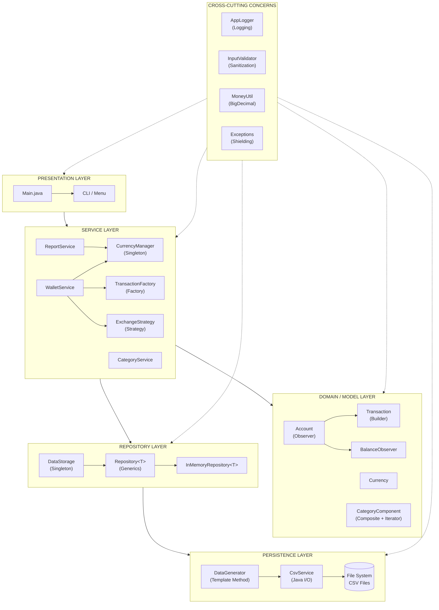
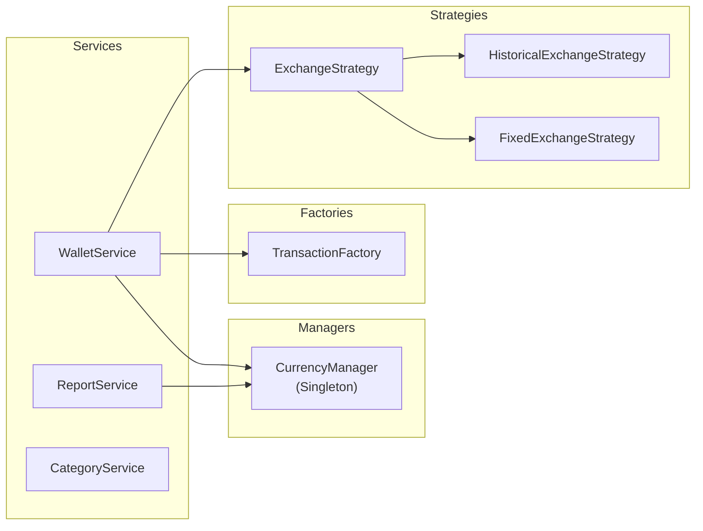
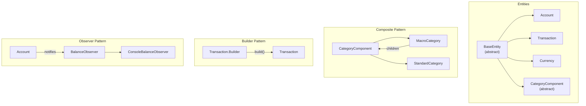
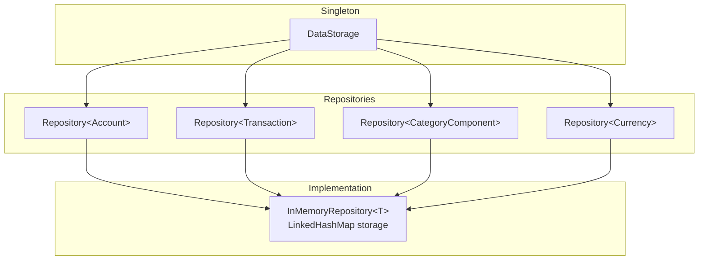
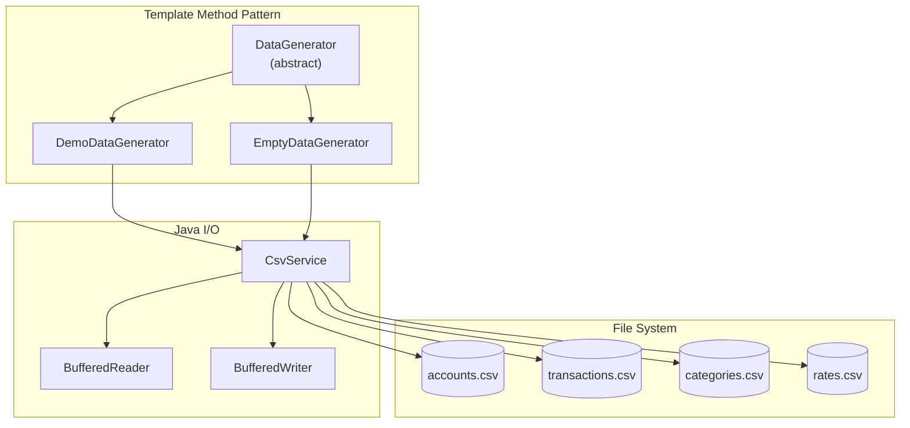
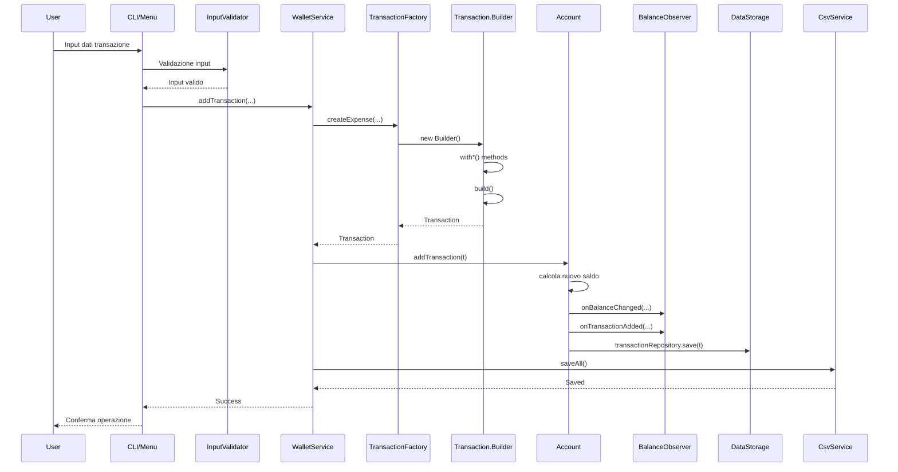
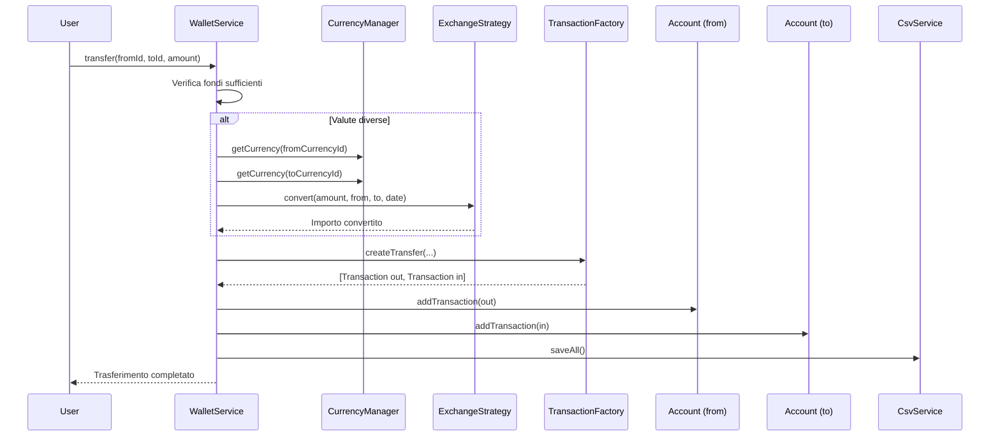
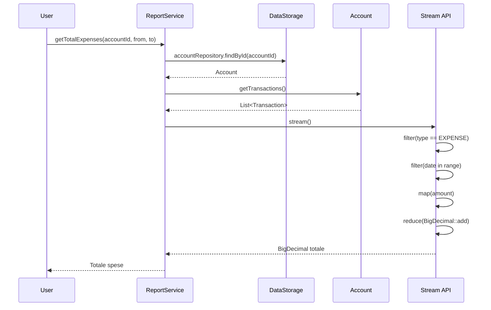

# Architecture Diagram - MySmartWallet

Diagramma architetturale a strati dell'applicazione MySmartWallet.

## Architettura a Strati

## Dettaglio Service Layer

## Dettaglio Model Layer

## Dettaglio Repository Layer

## Dettaglio Persistence Layer

## Flusso Dati: Aggiunta Transazione

## Flusso Dati: Trasferimento tra Conti

## Flusso Dati: Generazione Report

## Pattern Utilizzati per Layer

| Layer | Pattern | Implementazione |
| ----- | ------- | --------------- |
| Presentation | - | Main.java, CLI Menu |
| Service | Factory | TransactionFactory |
| Service | Strategy | ExchangeStrategy |
| Service | Singleton | CurrencyManager |
| Model | Builder | Transaction.Builder |
| Model | Composite | CategoryComponent |
| Model | Iterator | MacroCategory.iterator() |
| Model | Observer | BalanceObserver |
| Repository | Singleton | DataStorage |
| Repository | Generics | Repository<T extends BaseEntity> |
| Persistence | Template Method | DataGenerator |
| Persistence | Java I/O | CsvService |
| Cross-Cutting | Exception Shielding | Package exception/ |
| Cross-Cutting | Logging | AppLogger |

## Tecnologie per Layer

| Layer | Tecnologia | Utilizzo |
| ----- | ---------- | -------- |
| Service | Stream API | ReportService - filter, map, collect, groupingBy |
| Model | Collections | TreeMap (rates), ArrayList (transactions, children) |
| Repository | Collections | LinkedHashMap (storage) |
| Repository | Generics | Repository<T extends BaseEntity> |
| Persistence | Java I/O | BufferedReader/Writer, UTF-8, try-with-resources |
| Cross-Cutting | Logging | java.util.logging via AppLogger |
| Cross-Cutting | Validation | InputValidator - sanitization |
| Testing | JUnit 5 | Test unitari per tutte le componenti |
