# Class Diagram - MySmartWallet

Diagramma delle classi dell'applicazione MySmartWallet con rappresentazione delle relazioni tra componenti.

## Package model

### Gerarchia BaseEntity

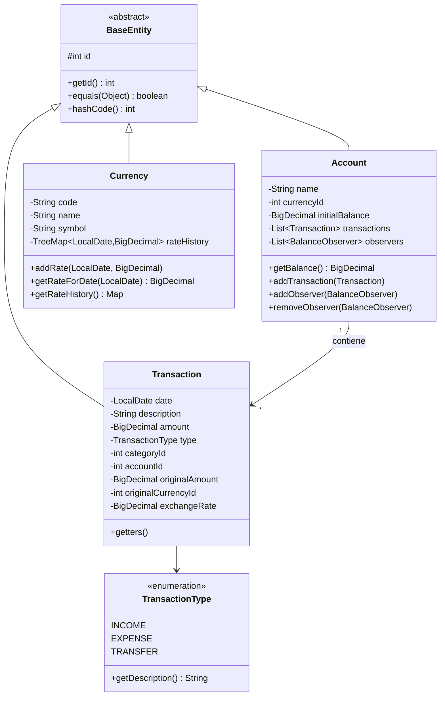

### Builder Pattern (Transaction)

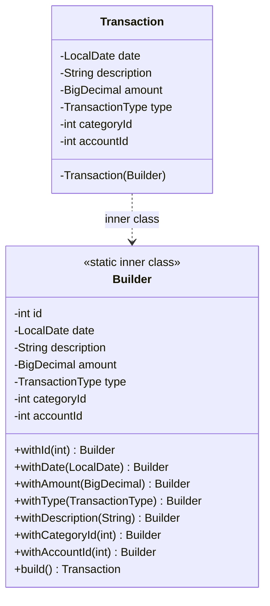

### Composite Pattern (Categories)

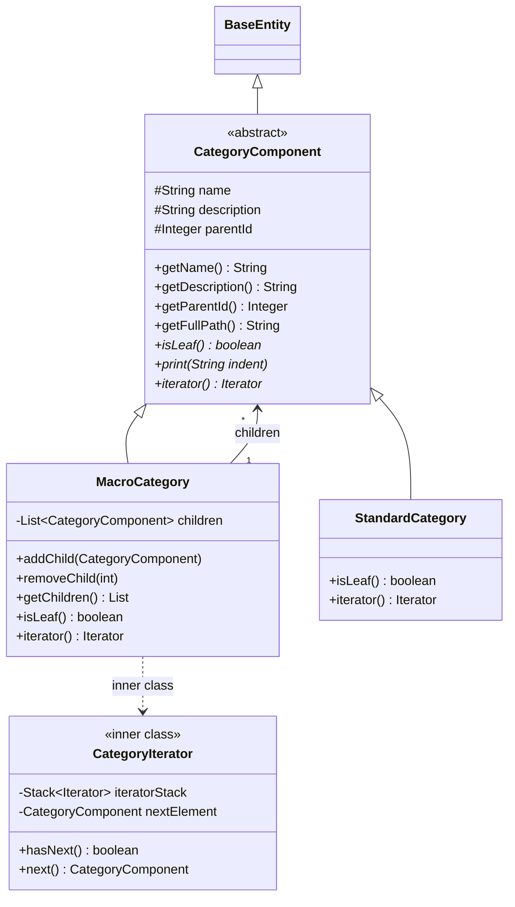

## Package repository

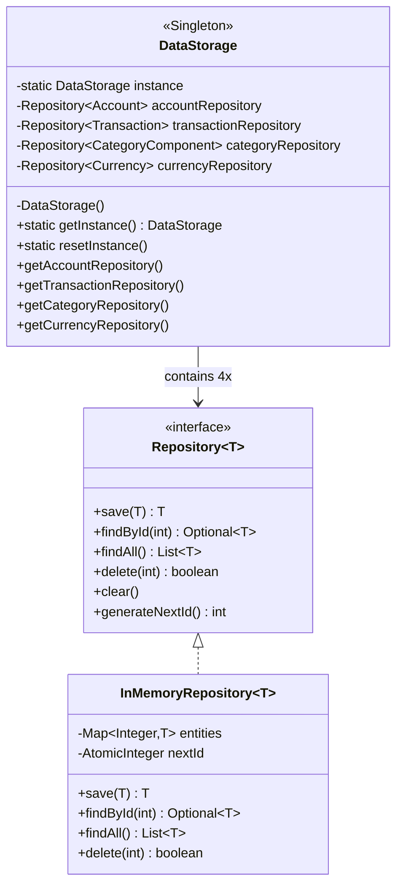

## Package service

### Strategy Pattern (Exchange)

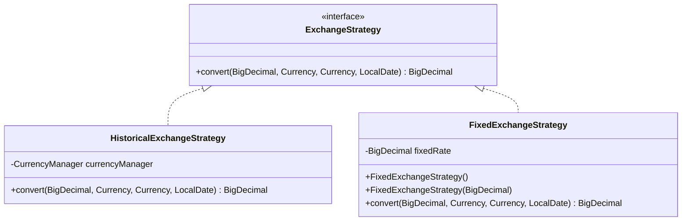

### Observer Pattern (Balance)

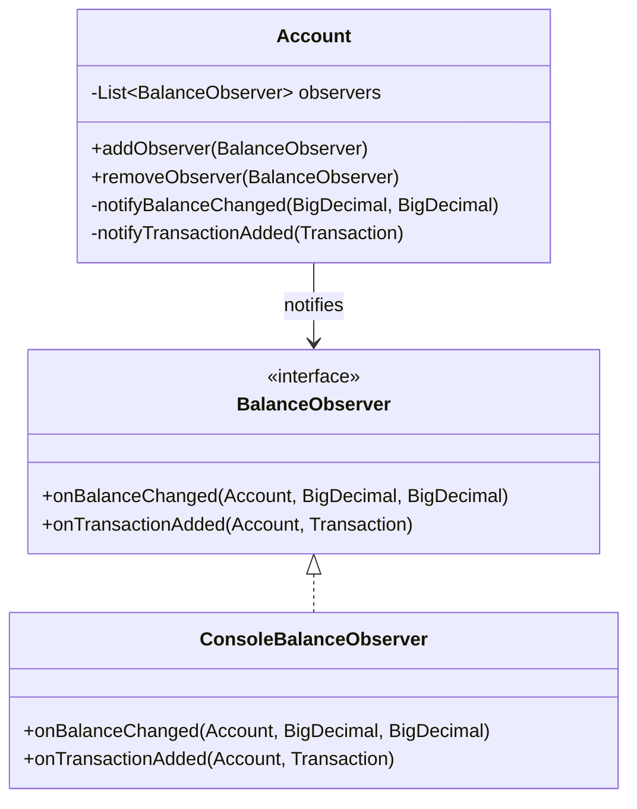

### Factory Pattern

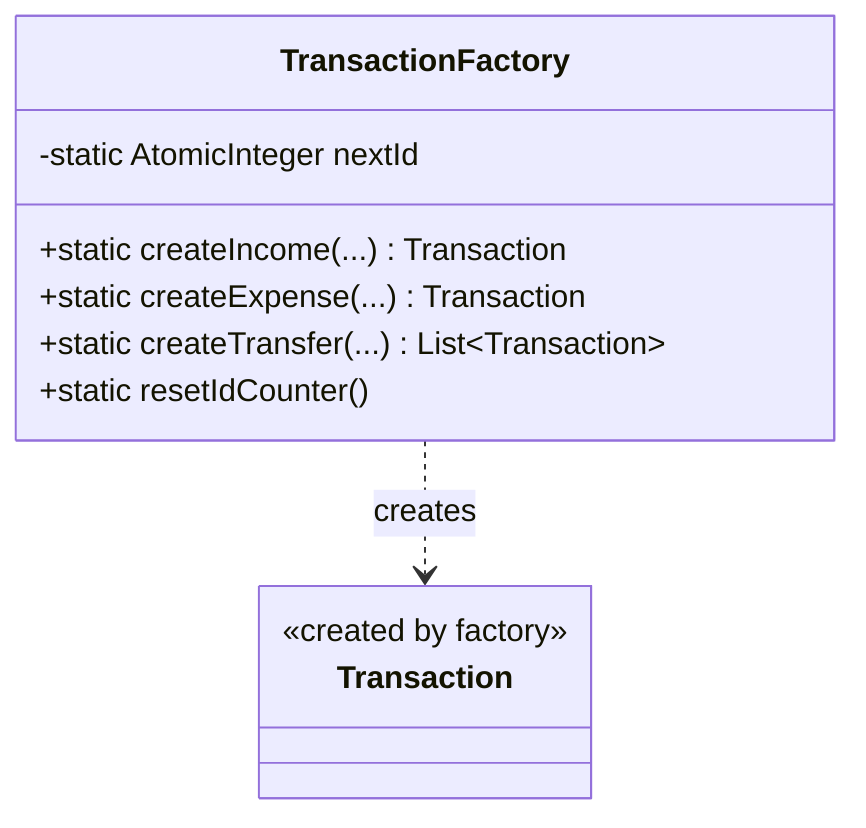

### Singleton Pattern

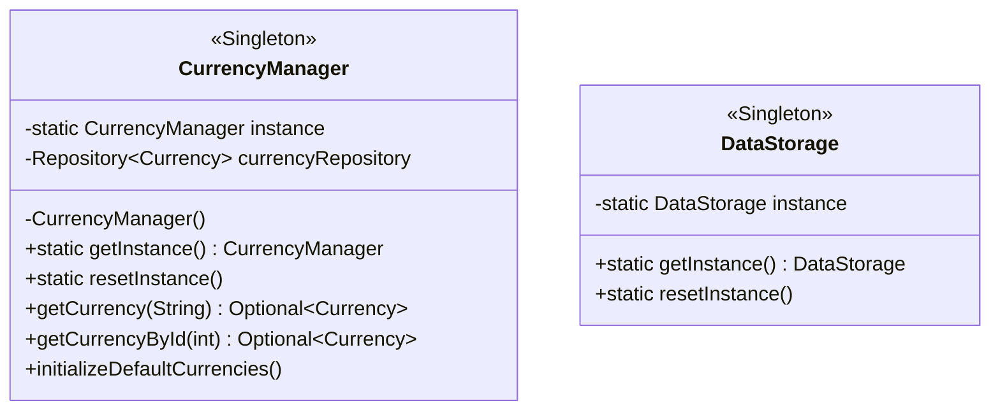

## Package persistence

### Template Method Pattern

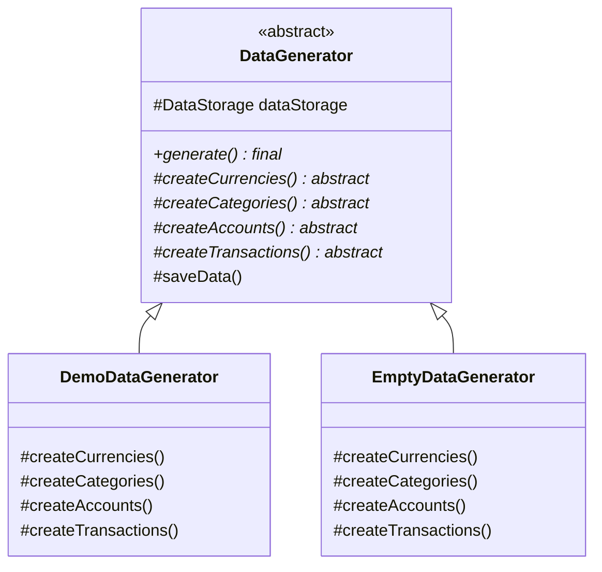

### CsvService

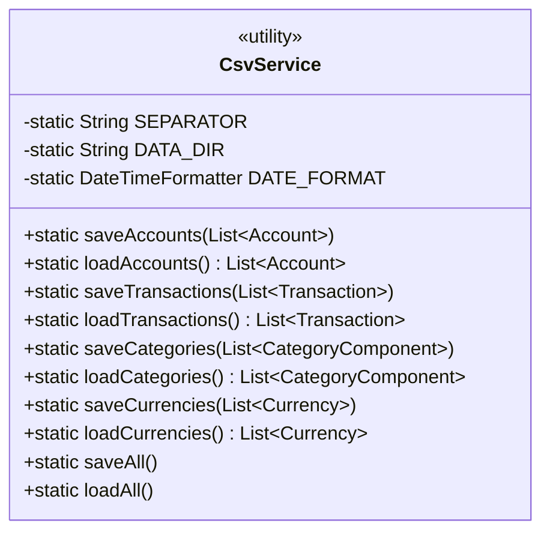

## Package exception

### Exception Shielding

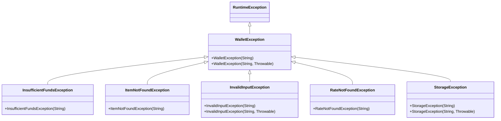

## Relazioni Principali

| Relazione | Descrizione |
| --------- | ----------- |
| `Account` → `Transaction` | Composizione: Account contiene lista di transazioni |
| `Account` → `BalanceObserver` | Observer: Account notifica i cambiamenti di saldo |
| `MacroCategory` → `CategoryComponent` | Composite: MacroCategory contiene figli |
| `WalletService` → `ExchangeStrategy` | Strategy: Algoritmo di conversione intercambiabile |
| `DataStorage` → `Repository` | Singleton: Container centralizzato dei repository |
| `Transaction.Builder` → `Transaction` | Builder: Costruzione fluida di transazioni |
| `TransactionFactory` → `Transaction` | Factory: Creazione centralizzata di transazioni |
| `DataGenerator` → Sottoclassi | Template Method: Algoritmo con dettagli variabili |
